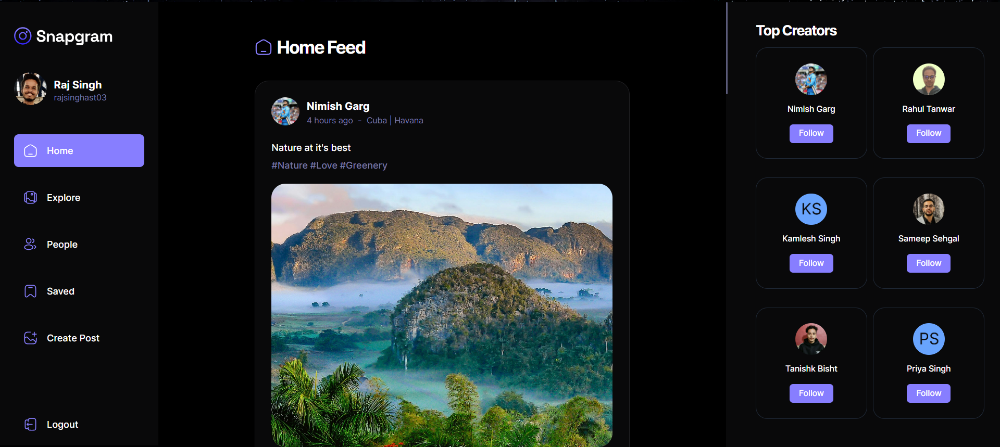

<div align="center">

  

  <h2>Snapgram</h2>
  
  <hr>

</div>


<!-- Brief -->
<p align="center">
Explore social media with this user-friendly platform that has a nice look and lots of features. Easily create and explore posts, and enjoy a strong authentication system and quick data fetching using React Query for a smooth user experience.
</p>

<!-- Screenshot -->
<a align="center" href="https://the-forest-home.vercel.app/">



</a>

## Table of contents

- [Key Features](#key-features)
- [My process](#my-process)
  - [Built with](#built-with)
  - [What I learned](#what-i-learned)
- [Installation](#installation)


## Key Features

👉 Authentication System: A robust authentication system ensuring security and user privacy

👉 Explore Page: Homepage for users to explore posts, with a featured section for top creators

👉 Like and Save Functionality: Enable users to like and save posts, with dedicated pages for managing liked and saved content

👉 Detailed Post Page: A detailed post page displaying content and related posts for an immersive user experience

👉 Profile Page: A user profile page showcasing liked posts and providing options to edit the profile

👉 Browse Other Users: Allow users to browse and explore other users' profiles and posts

👉 Create Post Page: Implement a user-friendly create post page with effortless file management, storage, and drag-drop feature

👉 Edit Post Functionality: Provide users with the ability to edit the content of their posts at any time

👉 Responsive UI with Bottom Bar: A responsive UI with a bottom bar, enhancing the mobile app feel for seamless navigation

👉 React Query Integration: Incorporate the React Query (Tanstack Query) data fetching library for, Auto caching to enhance performance, Parallel queries for efficient data retrieval, First-class Mutations, etc

👉 Backend as a Service (BaaS) - Appwrite: Utilize Appwrite as a Backend as a Service solution for streamlined backend development, offering features like authentication, database, file storage, and more

and many more, including code architecture and reusability


### Built with

- React
- Appwrite
- React Query
- React Router
- React Hook Form
- Typescript
- React lazy-load-image
- Shadcn
- Vite

### What I Learned

- **React Fundamentals:** I gained a solid understanding of React, including components, state management, and routing, allowing me to build dynamic user interfaces.

- **Authentication and User Management:** I implemented user authentication using Supabase, ensuring secure access for hotel employees and learned to manage user profiles effectively.

- **Form Handling:** I became proficient in managing forms with React Hook Form, simplifying form validation, submission, and data handling.

- **Data Fetching and Caching:** React Query was employed to fetch and cache data, enhancing the performance and responsiveness of the application.

- **Real-time Updates:** I integrated real-time data updates using Supabase, enabling instant changes to cabin and booking data.

- **Responsive UI Design:** Styled Components were used to create responsive and visually appealing user interfaces that adapt to various screen sizes.

- **Toast Notifications:** React Hot Toast added user-friendly notifications for various actions within the app, improving the overall user experience.

- **Data Visualization:** Recharts was employed for creating charts and visual representations of vital statistics, aiding in data analysis and decision-making.

- **Routing and Navigation:** React Router facilitated smooth navigation and seamless transitions between different views and pages within the application.

- **Settings Management:** I learned to allow users to configure application-wide settings, such as breakfast pricing and booking constraints.

- **Higher-Order Components (HOC):** I utilized Higher-Order Components to enhance code reusability and share common functionalities among multiple components.

- **Compound Component Pattern:** I implemented the Compound Component Pattern to create cohesive and reusable component groups, improving the organization and maintainability of the code.

- **Dark Mode Implementation:** Dark mode was implemented to offer users a personalized visual experience and accommodate different preferences.

- **Git Version Control:** I practiced effective version control using Git, allowing for code management, and tracking project changes.

- **Project Planning and Management:** I gained experience in planning and managing a large-scale project, including feature development, bug fixing, and testing.

By building "The Wild Oasis" project with these technologies and concepts, I've developed a comprehensive set of skills and knowledge that can be applied to future projects and real-world scenarios. This experience has not only expanded my technical expertise but also improved my problem-solving capabilities.

### Installation

**Prerequisites**

Make sure you have the following installed on your machine:

- [Git](https://git-scm.com/)
- [Node.js](https://nodejs.org/en)
- [npm](https://www.npmjs.com/) (Node Package Manager)

**Cloning the Repository**

```bash
git clone https://github.com/rajsinghast03/SnapGram.git
cd SnapGram
```

**Installation**

Install the project dependencies using npm:

```bash
npm install
```

**Set Up Environment Variables**

Create a new file named `.env` in the root of your project and add the following content:

```env
VITE_APPWRITE_URL=
VITE_APPWRITE_PROJECT_ID=
VITE_APPWRITE_DATABASE_ID=
VITE_APPWRITE_STORAGE_ID=
VITE_APPWRITE_USER_COLLECTION_ID=
VITE_APPWRITE_POST_COLLECTION_ID=
VITE_APPWRITE_SAVES_COLLECTION_ID=
```

Replace the placeholder values with your actual Appwrite credentials. You can obtain these credentials by signing up on the [Appwrite website](https://appwrite.io/).

**Running the Project**

```bash
npm start
```

